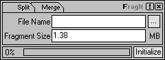



## \[\- FragIt \-\] It means it\!

### Description

This is a MUST HAVE program. It does what it sounds. It splits a file into several fragment files of a given size. It also can merge those fragment files in the original file without loosing any data. COOL! isn't it??!
 
### More Info
 

             |
---                |---
**Submitted On**   |2002-06-27 10:14:24
**By**             |[Zubuyer Kaolin](https://github.com/Planet-Source-Code/PSCIndex/blob/master/ByAuthor/zubuyer-kaolin.md)
**Level**          |Advanced
**User Rating**    |5.0 (80 globes from 16 users)
**Compatibility**  |VB 6\.0
**Category**       |[Files/ File Controls/ Input/ Output](https://github.com/Planet-Source-Code/PSCIndex/blob/master/ByCategory/files-file-controls-input-output__1-3.md)
**World**          |[Visual Basic](https://github.com/Planet-Source-Code/PSCIndex/blob/master/ByWorld/visual-basic.md)
**Archive File**   |[\[\-\_FragIt\_988416262002\.zip](https://github.com/Planet-Source-Code/zubuyer-kaolin-fragit-it-means-it__1-36279/archive/master.zip)

